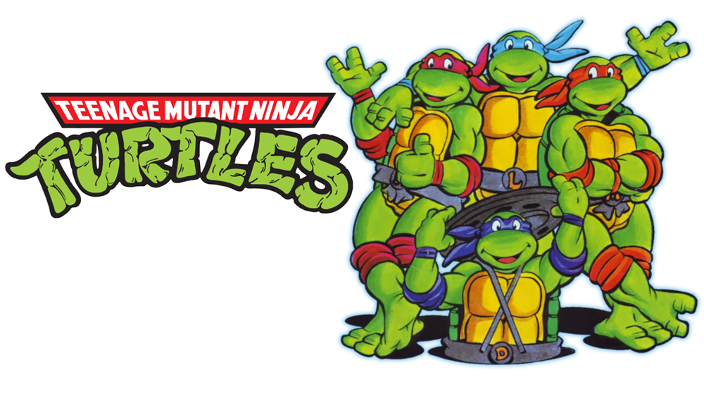

# Jouons avec Python Turtle



Turtle est un module `python`, il permet de dessiner des formes à l'écran.
Vous contrôlez un curseur que vous pouvez faire avancer avec des commandes.

```python
import turtle

turtle.forward(10) # avance le curseur de 10
turtle.backward(10) # recule le curseur de 10
turtle.left(90) # tourne le curseur de 90 degrés vers la gauche
turtle.right(90) # vers la droite

turtle.penup() # lève le curseur
turtle.pendown() # baisse le curseur    
```

Voici un exemple d'un programme dessinant un carré :

```python
import turtle
turtle.forward(100)
turtle.left(90)
turtle.forward(100)
turtle.left(90)
turtle.forward(100)
turtle.left(90)
turtle.forward(100)
turtle.left(90)
```

# Un peu de style

Vous pouvez personnaliser vos dessins avec différentes fonctions :

```python
turtle.speed(vitesse) # change la vitesse du curseur
turtle.pensize(taille) # change la taille du trait
turtle.pencolor(rouge, vert, bleu)
# chaque composante est comprise entre 0 et 1
```

# Installation

```shell
sudo apt-get install python python-tk
```

# Pour aller plus loin

[WikiBook - Une tortue qui accélère la résolution de problèmes](https://fr.wikibooks.org/wiki/Math%C3%A9matiques_avec_Python_et_Ruby/Une_tortue_qui_acc%C3%A9l%C3%A8re_la_r%C3%A9solution_de_probl%C3%A8mes)
